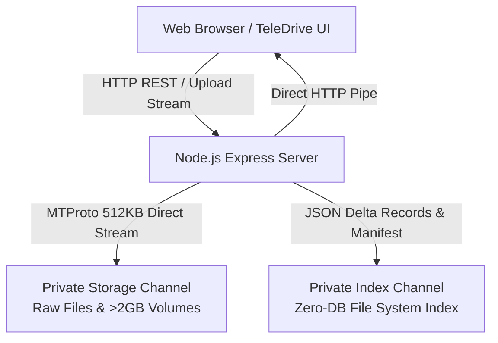
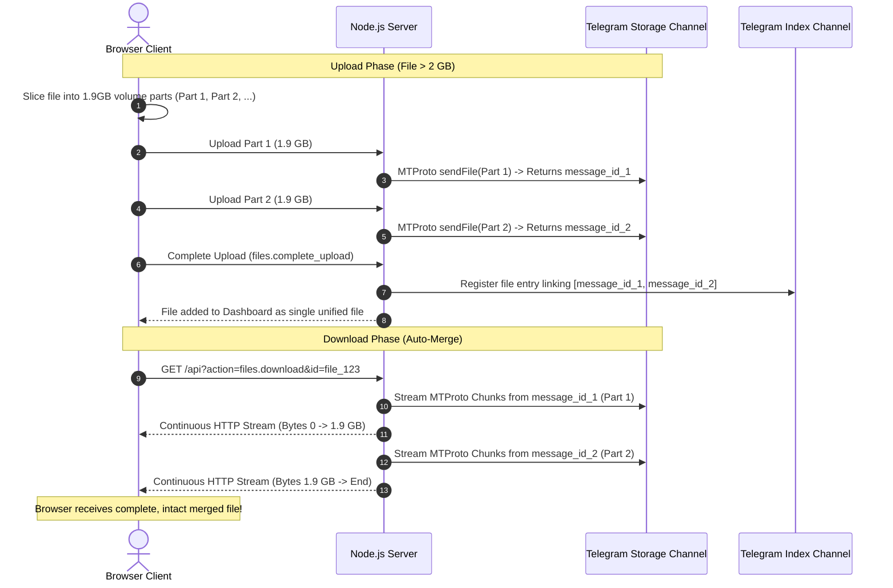

# 🚀 TeleDrive — Zero-Database Telegram Cloud Drive (Node.js + MTProto)

> **Developed & Maintained by [Rahul Kumar](https://github.com/rahulkumar), Owner of Art-Tech Fuzion**

**TeleDrive** is a high-performance, open-source personal cloud storage manager built with **Node.js, Express, and native Telegram MTProto (GramJS)** featuring a modern Google Drive-inspired web interface.

It transforms your free Telegram account into an **unlimited, secure, zero-database personal cloud drive** with native support for **2GB+ file uploads**, zero-disk streaming downloads, and automated metadata checkpointing.

---

## 🌟 Key Highlights & Features

| Feature | Description | Benefit |
| :--- | :--- | :--- |
| ⚡ **Native 2GB Uploads** | Uses native MTProto User Client sessions (GramJS) instead of Bot API. | Bypasses traditional 50MB Bot limit (100% Free Telegram Account). |
| 📦 **Unlimited File Size (>2GB)** | Automatic slicing into 1.9 GB volume parts on upload with seamless back-to-back stream merge on download. | Upload and download 5GB, 10GB+ files without disk extraction. |
| 🗄️ **Zero-Database Engine** | Telegram serves as both the object storage and distributed NoSQL database via append-only JSON delta logs. | No MySQL, PostgreSQL, SQLite, or MongoDB setup required. |
| 🌊 **Zero-Disk Streaming** | Streams file bytes directly from Telegram data centers into HTTP responses in 512KB MTProto chunks. | Ultra-low RAM & zero server disk storage consumption. |
| 📊 **Real-Time Transfer Metrics** | Live byte counters, percentage completion, and transfer speed in MB/s via `XMLHttpRequest.upload`. | Clear visibility during large file transfers. |
| 🎨 **Google Drive Interface** | Responsive, dark-themed dashboard with folder hierarchy, search, multi-selection, and drag-and-drop. | Familiar, sleek, and intuitive user experience. |
| 🔒 **Enterprise-Grade Security** | Session-based authentication, CSRF token validation, brute-force rate limiting, and private channel isolation. | Safe, isolated, and protected from unauthorized access. |

---

## 🏗️ Technical Architecture



---

## 📋 Table of Contents

1. [Prerequisites](#-prerequisites)
2. [Step-by-Step Setup Guide](#-step-by-step-setup-guide)
   - [Step 1: Get Telegram API ID and API Hash](#step-1-get-telegram-api-id-and-api-hash)
   - [Step 2: Create Storage & Index Channels](#step-2-create-storage--index-channels)
   - [Step 3: Clone & Install Dependencies](#step-3-clone--install-dependencies)
   - [Step 4: Generate Telegram MTProto Session](#step-4-generate-telegram-mtproto-session)
   - [Step 5: Configure Environment Variables (.env)](#step-5-configure-environment-variables-env)
   - [Step 6: Start the Server](#step-6-start-the-server)
3. [Production Deployment Guide](#-production-deployment-guide)
   - [Automated GitHub Actions FTP Deployment](#1-automated-github-actions-ftp-deployment)
   - [Server SSH Setup & One-Time Dependency Installation](#2-server-ssh-setup--one-time-dependency-installation)
   - [Hosting Panel Configuration (cPanel / mPanel / Cloudways / VPS)](#3-hosting-panel-configuration)
4. [How Multi-Part >2GB Uploads Work](#-how-multi-part-2gb-uploads-work)
5. [Zero-Database Compaction Engine](#-zero-database-compaction-engine)
6. [API Reference](#-api-reference)
7. [Security & Account Safety](#-security--account-safety)
8. [Author & Credits](#-author--credits)

---

## ⚙️ Prerequisites

Before running TeleDrive, ensure you have the following ready:

- **Node.js**: `v18.0.0`, `v20.x (LTS)`, or `v22.x` installed.
- **npm**: `v9.0.0` or higher.
- **Telegram Account**: A standard, free Telegram account.

---

## 📖 Step-by-Step Setup Guide

### Step 1: Get Telegram API ID and API Hash

Telegram requires standard MTProto developer credentials to connect to its cloud network:

1. Navigate to **[https://my.telegram.org](https://my.telegram.org)** in your web browser.
2. Enter your phone number (including country code, e.g., `+1...` or `+91...`).
3. Enter the login confirmation code sent to your official Telegram app.
4. Click on **API development tools**.
5. Fill out the application form:
   - **App title**: Enter any name (e.g., `MyTeleDriveApp`).
   - **Short name**: Enter a short alphanumeric name in lowercase with **no spaces or hyphens** (e.g., `teledriveapp1`).
   - **Platform**: Select `Web` or `Desktop`.
   - **URL / Description**: Leave blank or enter a brief summary.
6. Click **Create Application**.
7. Copy the generated credentials:
   - `App api_id` (numeric, e.g., `12345678`)
   - `App api_hash` (32-character string, e.g., `0123456789abcdef0123456789abcdef`)

> [!TIP]
> If `my.telegram.org` displays an error during submission, ensure your **Short name** is completely lowercase and contains only letters and numbers without spaces.

---

### Step 2: Create Storage & Index Channels

TeleDrive utilizes two private Telegram channels to cleanly separate binary storage from file system indexing:

1. Open Telegram and create **two new Private Channels**:
   - **Channel 1 (Storage Channel)**: Name it `TeleDrive Storage` (stores raw binary file chunks).
   - **Channel 2 (Index Channel)**: Name it `TeleDrive Index` (stores directory metadata & manifests).
2. **Retrieve Your Channel IDs**:
   - **Method A (Telegram Web)**:
     - Open [Telegram Web](https://web.telegram.org/).
     - Open the channel. The URL in the address bar will appear as `https://web.telegram.org/a/#-1001234567890`.
     - The channel ID is `-1001234567890`.
   - **Method B (Via Telegram Bot)**:
     - Forward any message from your channel to [@userinfobot](https://t.me/userinfobot) or [@username_to_id_bot](https://t.me/username_to_id_bot) to get the numeric ID starting with `-100`.

---

### Step 3: Clone & Install Dependencies

Clone the repository and install all required Node.js packages:

```bash
git clone https://github.com/ART-TECH-FUZION/TeleDrive-nodejs.git
cd TeleDrive-nodejs
npm install
```

---

### Step 4: Generate Telegram MTProto Session

Run the interactive session generator CLI to generate an encrypted `STRING_SESSION`:

```bash
npm run generate-session
```

**Interactive Prompts:**
1. Enter your `API_ID` and `API_HASH` (from Step 1).
2. Enter your Telegram phone number with international country code.
3. Enter the 5-digit verification code sent to your Telegram app.
4. *(If Two-Step Verification is enabled)*: Enter your 2FA cloud password.

> [!NOTE]
> The script connects to Telegram MTProto, generates an encrypted `STRING_SESSION`, and automatically writes or updates your `.env` file.

---

### Step 5: Configure Environment Variables (`.env`)

Verify your [`.env`](file:///.env) file configuration:

```ini
# ===============================================================================
# Server & Network Configuration
# ===============================================================================
PORT=3000
HOST=0.0.0.0

# ===============================================================================
# Admin Web Authentication
# ===============================================================================
ADMIN_USERNAME=admin
# Secure bcrypt password hash (leave empty for default password 'admin')
ADMIN_PASSWORD_HASH=$2a$10$N9qo8uLOickgx2ZMRZoMyeIjZAgcfl7p92ldGxad68LJZdL17lhWy

# ===============================================================================
# Web Session Security (32+ Character Secret)
# ===============================================================================
SESSION_SECRET=e7c8b4f19a0d3e527184bc910a72ef83d95c18402b934710ae728df91024bc6a

# ===============================================================================
# Telegram MTProto Credentials
# ===============================================================================
API_ID=12345678
API_HASH=0123456789abcdef0123456789abcdef
STRING_SESSION=1BWVo...your_generated_string_session...

# ===============================================================================
# Telegram Private Channels (Must start with -100)
# ===============================================================================
STORAGE_CHANNEL_ID=-1001234567890
INDEX_CHANNEL_ID=-1009876543210

# ===============================================================================
# Local Storage Cache & Chunks
# ===============================================================================
TEMP_CHUNK_DIR=temp_chunks
```

#### What Each Variable Does & How to Generate Them:

- **`STRING_SESSION` (Telegram MTProto Auth Key):**
  - **What it is**: An encrypted authorization token generated by GramJS when you log into Telegram with your phone number and OTP code.
  - **Why it is needed**: Unlike a Telegram Bot token (which is limited to 50MB files and cannot access user MTProto methods), `STRING_SESSION` authorizes your Node.js server as a native Telegram **User Client**. This enables the **full 2.0 GB upload limit**, high-speed multi-threaded transfers, and zero-disk streaming downloads without requiring you to re-authenticate with an OTP code every time the server boots or restarts.
  - **How to generate**: Run `npm run generate-session` in your terminal and follow the interactive prompts.

- **`SESSION_SECRET` (Web Session Cookie Signing Key):**
  - **What it is**: A high-entropy cryptographic secret used by `express-session` to sign and verify the `TELEDRIVE_SESSID` cookie.
  - **Why it is needed**: Prevents attackers from tampering with or forging session cookies to bypass the login screen.
  - **Generate command**:
    ```bash
    node -e "console.log(require('crypto').randomBytes(32).toString('hex'))"
    ```
    *(Alternative with OpenSSL: `openssl rand -hex 32`)*

- **`ADMIN_PASSWORD_HASH` (Bcrypt Password Hash):**
  - **What it is**: A one-way bcrypt cryptographic hash of your admin password.
  - **Why it is needed**: Protects your dashboard in production. If left empty, the system defaults to password `admin`, which allows anyone on the internet to access your private Telegram files.
  - **Generate command**:
    ```bash
    node -e "require('bcryptjs').hash('MySecurePassword123!', 10).then(console.log)"
    ```
    Copy the generated `$2a$10$...` hash and paste it into `ADMIN_PASSWORD_HASH` in `.env`.

> [!TIP]
> - **Bcrypt Hash (Recommended)**: Always paste the generated `$2a$...` hash into `ADMIN_PASSWORD_HASH` on live servers.
> - **Blank / Unset**: If left empty in local development, the password defaults to `admin`.
> - **Plaintext Fallback**: If you enter a plaintext password in `.env`, the system validates against it directly.

---

### Step 6: Start the Server

Start your application in production or development mode:

```bash
# Production mode
npm start

# Development mode (with live file watching)
npm run dev
```

Open your browser and navigate to:
```
http://localhost:3000
```

**Default Credentials:**
- **Username**: `admin`
- **Password**: `admin` *(or the custom password you configured)*

---

## 🚀 Production Deployment Guide

### 1. Automated GitHub Actions FTP Deployment

This repository includes an optimized CI/CD workflow ([`.github/workflows/deploy.yml`](file:///.github/workflows/deploy.yml)) that deploys your code to your server via FTP on every push.

> ⚡ **Ultra-Fast Deployments**: `node_modules` (6,500+ files) is excluded from FTP transfers. FTP only transfers clean source code (`server.js`, `src/`, `assets/`, `templates/`, `package.json`), completing in under 5 seconds.

#### Setting Up GitHub Secrets:
1. In your GitHub repository, go to **Settings $\rightarrow$ Secrets and variables $\rightarrow$ Actions**.
2. Click **New repository secret** and add:
   - `FTP_SERVER`: Your server FTP host or IP (e.g., `ftp.yourdomain.com` or `123.45.67.89`).
   - `FTP_USERNAME`: Your FTP account username.
   - `FTP_PASSWORD`: Your FTP account password.

---

### 2. Server SSH Setup & One-Time Dependency Installation

#### Step A: Connect to Your Server via SSH
```bash
ssh username@your_server_ip
```

#### Step B: Navigate to Your Domain Directory
- **cPanel / mPanel (Primary Domain)**:
  ```bash
  cd public_html
  ```
- **cPanel / mPanel (Addon Domain / Subdomain)**:
  ```bash
  cd domains/yourdomain.com/public_html
  # or: cd yourdomain.com
  ```
- **Cloudways / VPS / Custom Stack**:
  ```bash
  cd /var/www/yourdomain.com
  ```

#### Step C: Install Dependencies on the Server (One-Time)
```bash
npm install --production
```
*(Only needed once, or whenever you modify `package.json`)*.

#### Step D: Create Your Production `.env` File

Before editing `.env`, generate your production secret and password hash directly on the server:

1. **Generate Session Secret**:
   ```bash
   node -e "console.log(require('crypto').randomBytes(32).toString('hex'))"
   ```
2. **Generate Admin Password Hash**:
   ```bash
   node -e "require('bcryptjs').hash('YourStrongPasswordHere', 10).then(console.log)"
   ```

Now open `.env` with a text editor:
```bash
nano .env
```
Paste your production environment variables (including `STRING_SESSION`, `STORAGE_CHANNEL_ID`, `INDEX_CHANNEL_ID`, `SESSION_SECRET`, and `ADMIN_PASSWORD_HASH`). Then press `Ctrl + O`, `Enter` to save, and `Ctrl + X` to exit.

---

### 3. Hosting Panel Configuration

In your hosting control panel under **Manage Node / Node.js Applications**:

| Setting | Recommended Value | Notes |
| :--- | :--- | :--- |
| **Application Mode** | `Automatic (Production)` | Automatically restarts on unexpected exit or memory threshold |
| **Node Version** | `20.x` or `22.x` (LTS) | Fully compatible with Node 18, 20, and 22+ |
| **Startup Command** | `npm start` | Executes `node server.js` |
| **Application Port** | `3000` | Internal port where Express listens |
| **Proxy Path** | `/` | Proxies all primary domain traffic to Node.js |
| **WebSocket Upgrade** | `Disabled / Unchecked` | Not required (TeleDrive uses standard HTTP streaming) |

Click **Deploy Node App** or **Restart Application** to bring your live site online.

---

## 📦 How Multi-Part >2GB Uploads Work

Telegram MTProto allows standard user accounts to upload up to **2.0 GB per individual document**. For files exceeding 2 GB, TeleDrive uses an automated chunking and stream-merging pipeline:



---

## 🗄️ Zero-Database Compaction Engine

TeleDrive operates completely independently of traditional databases using an append-only delta architecture directly on your private Telegram Index Channel:

1. **Delta Logging**: Every CRUD action (file uploaded, folder created, renamed, or deleted) posts a lightweight JSON delta message to the Index Channel.
2. **Local Caching**: The file system index is cached in memory and in `temp_chunks/index_cache.json` for sub-millisecond API response times.
3. **Automated Compaction**: When delta messages reach the compaction threshold:
   - TeleDrive merges all delta records into a unified directory tree.
   - Uploads a new `master_manifest.json` document to the Index Channel.
   - Pins the new manifest message.
   - Unpins old manifests and purges superseded delta messages.

---

## 🔌 API Reference

TeleDrive provides a RESTful API and unified action router (`/api` and backward-compatible `/api/index.php`):

### Authentication Endpoints

| Endpoint | Method | Params | Description |
| :--- | :--- | :--- | :--- |
| `/api?action=auth.status` | `GET` | — | Check authentication state & CSRF token |
| `/api?action=auth.login` | `POST` | `username`, `password` | Authenticate and create session |
| `/api?action=auth.logout` | `POST` | — | Destroy session and log out |

### File & Folder Endpoints

| Endpoint | Method | Params | Description |
| :--- | :--- | :--- | :--- |
| `/api?action=files.list` | `GET` | `parent_id`, `search` | List items in active directory |
| `/api?action=files.direct_upload` | `POST` | `file`, `parent_id`, `upload_id` | Single-file direct upload ($\le$ 2 GB) |
| `/api?action=files.upload_progress` | `GET` | `upload_id` | Live MTProto upload transfer progress |
| `/api?action=files.upload_chunk` | `POST` | `chunk`, `upload_id`, `chunk_index` | Upload volume part (> 2 GB) |
| `/api?action=files.complete_upload`| `POST` | `upload_id`, `filename`, `size` | Finalize multi-part upload |
| `/api?action=files.download` | `GET` | `id` | Stream binary file directly to browser |
| `/api?action=files.preview` | `GET` | `id` | Inline stream for image/video preview |
| `/api?action=folder.create` | `POST` | `name`, `parent_id` | Create a new virtual folder |
| `/api?action=item.rename` | `POST` | `id`, `name` | Rename a file or folder |
| `/api?action=item.move` | `POST` | `id`, `target_parent_id` | Move item to a different folder |
| `/api?action=item.delete` | `POST` | `id` | Delete item & remove Telegram cloud parts |
| `/api?action=items.bulk_delete` | `POST` | `ids` | Bulk delete multiple items |

---

## 🛡️ Security & Account Safety

1. **Keep Channels Private**: Never set your Storage or Index Channel to public. Private channels ensure data is accessible only by your authenticated server instance.
2. **Protect Your `.env`**: Never commit your `.env` file or `STRING_SESSION` to GitHub or public repositories.
3. **Dedicated API Keys**: Always create and use your own `API_ID` and `API_HASH` from `my.telegram.org` to ensure proper authorization.
4. **Prevent Session Revocation (`AUTH_KEY_DUPLICATED`)**:
   - **Why it happens**: If you run your local development server (`npm run dev`) and live production server simultaneously using the **exact same `STRING_SESSION`**, Telegram detects concurrent socket connections from multiple IP addresses/clients. To protect your account, Telegram automatically invalidates and revokes the active session key, throwing the error: `Concurrent usage of the current session from multiple connections was detected, the current session was invalidated by the server for security reasons!`.
   - **How to resolve if revoked**:
     1. Run `npm run generate-session` in your terminal to authenticate with your phone number and generate a fresh `STRING_SESSION`.
     2. Paste the newly generated `STRING_SESSION` into your production `.env` file.
     3. Restart your Node.js application server (`npm start` or restart in hosting control panel).
     4. Ensure you use separate `STRING_SESSION` keys for local development and live production environments.

---

## 👨‍💻 Author & Credits

- **Creator & Lead Developer**: **[Rahul Kumar](https://github.com/rahulkumar)** (Art-Tech Fuzion)
- **Supported & Maintained by**: **Art-Tech Fuzion Team**
- **Project Repository**: [TeleDrive-nodejs](https://github.com/ART-TECH-FUZION/TeleDrive-nodejs)

---

## 📄 License

This project is licensed under the [MIT License](file:///LICENSE).
Developed with ❤️ by **Rahul Kumar (Art-Tech Fuzion)**.