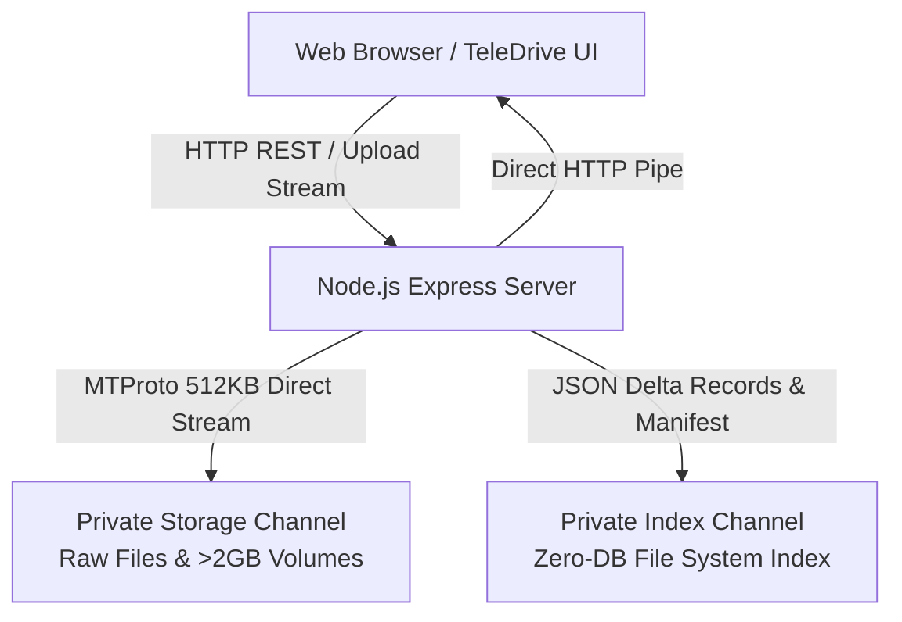
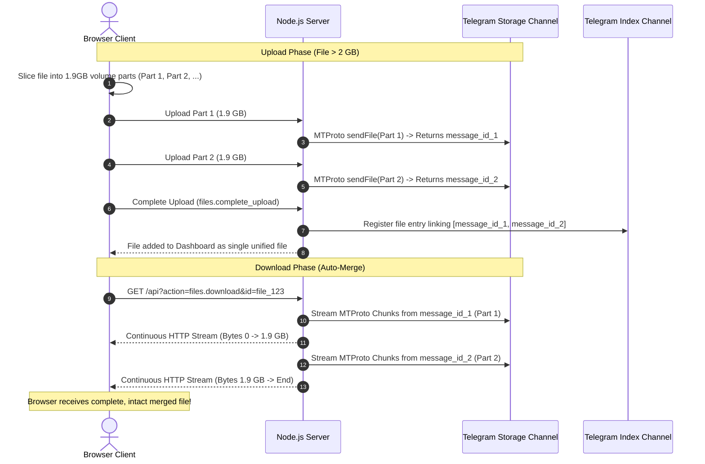

# 🚀 TeleDrive — Zero-Database Telegram Cloud Drive (Node.js + MTProto)

> **Developed & Maintained by [Rahul Kumar](https://github.com/rahulkumar), Owner of Art-Tech Fuzion**

**TeleDrive** is a high-performance, open-source personal cloud storage manager built with **Node.js, Express, and native Telegram MTProto (GramJS)** featuring a modern Google Drive-inspired web interface.

It transforms your free Telegram account into an **unlimited, secure, zero-database personal cloud drive** with native support for **2GB+ file uploads**, zero-disk streaming downloads, and automated metadata checkpointing.

---

## 🌟 Key Highlights & Features

- ⚡ **Native 2GB Single-File Uploads**: Bypasses the traditional 50MB Bot API limit by using native Telegram MTProto user client sessions (100% Free Telegram Account).
- 📦 **Unlimited File Size via Multi-Part Streaming (>2GB)**: Files exceeding 1.95 GB are automatically sliced into 1.9 GB volume parts on upload and seamlessly stream-merged back-to-back on download without requiring disk extraction or unzipping.
- 🗄️ **Zero-Database Architecture**: Telegram acts as both the raw object storage and the distributed database. Metadata is recorded as JSON delta messages in a private **Index Channel** and periodically compacted into a pinned `master_manifest.json`.
- 🌊 **Zero-Disk Streaming Downloads**: Downloads and previews stream data directly from Telegram's data centers into the HTTP response in 512KB MTProto chunks with virtually zero server RAM or disk usage.
- 📊 **Real-Time MTProto Progress**: Track upload and download progress in real-time with byte counters, percentage indicators, and live network transfer speed (MB/s).
- 🎨 **Google Drive-Inspired UI**: Responsive, dark-themed dashboard with folder hierarchy, search, multi-selection, drag-and-drop uploads, instant previews, and breadcrumb navigation.
- 🔒 **Enterprise-Grade Security**: Session-based authentication, CSRF token validation, brute-force rate limiting, and complete data isolation inside your private Telegram channels.

---

## 🏗️ Technical Architecture



---

## 📋 Table of Contents

1. [Prerequisites](#-prerequisites)
2. [Step-by-Step Setup Guide](#-step-by-step-setup-guide)
   - [Step 1: Get Telegram API ID and API Hash](#step-1-get-telegram-api-id-and-api-hash)
   - [Step 2: Create Storage & Index Channels](#step-2-create-storage--index-channels)
   - [Step 3: Clone & Install Dependencies](#step-3-clone--install-dependencies)
   - [Step 4: Generate Telegram MTProto Session](#step-4-generate-telegram-mtproto-session)
   - [Step 5: Verify Environment Variables (.env)](#step-5-verify-environment-variables-env)
   - [Step 6: Start the Server](#step-6-start-the-server)
3. [Production Deployment Guide](#-production-deployment-guide)
   - [Automated GitHub Actions FTP Deployment](#automated-github-actions-ftp-deployment)
   - [Panel Configuration (cPanel / mPanel / Hostinger / Cloudways)](#panel-configuration-cpanel--mpanel--hostinger--cloudways)
4. [How Multi-Part >2GB Uploads Work](#-how-multi-part-2gb-uploads-work)
5. [Zero-Database Compaction Engine](#-zero-database-compaction-engine)
6. [API Reference](#-api-reference)
7. [Security & Account Safety](#-security--account-safety)

---

## ⚙️ Prerequisites

Before getting started, make sure you have:
- **Node.js**: `v18.0.0`, `v20.x (LTS)`, or `v22.x` installed.
- **npm**: `v9.0.0` or higher.
- **Telegram Account**: A standard, free Telegram account.

---

## 📖 Step-by-Step Setup Guide

### Step 1: Get Telegram API ID and API Hash

Telegram requires standard MTProto developer credentials to allow applications to connect to its cloud network.

1. Open your browser and navigate to **[https://my.telegram.org](https://my.telegram.org)**.
2. Enter your phone number (including international country code, e.g. `+1...` or `+91...`).
3. You will receive a login confirmation code inside your official Telegram app. Enter the code to log in.
4. Click on **API development tools**.
5. Fill out the application form:
   - **App title**: Enter any clean title (e.g. `MyTeleDriveApp`).
   - **Short name**: Enter a short alphanumeric name with **no spaces or special symbols** (e.g. `teledriveapp1`).
   - **Platform**: Select `Web` or `Desktop`.
   - **URL / Description**: Leave blank or enter any simple description.
6. Click **Create Application**.
7. Once created, copy the following two values:
   - `App api_id` (numeric, e.g., `12345678`)
   - `App api_hash` (32-character hexadecimal string, e.g., `0123456789abcdef0123456789abcdef`)

> **Note**: If `my.telegram.org` returns an error when submitting the form, ensure your **Short name** is completely lowercase and contains only letters and numbers (no hyphens, dashes, or spaces).

---

### Step 2: Create Storage & Index Channels

TeleDrive uses two private Telegram channels to separate data storage from metadata indexing:

1. Open your Telegram app and create **two new Private Channels**:
   - **Channel 1 — Storage Channel**: Name it `TeleDrive Storage` (where your binary file parts will be uploaded).
   - **Channel 2 — Index Channel**: Name it `TeleDrive Index` (where metadata manifests and JSON directory states will be saved).
2. **Find the Channel IDs**:
   - **Method A (Telegram Web)**:
     - Open [Telegram Web (web.telegram.org)](https://web.telegram.org/).
     - Click on your channel. The URL in your browser will look like `https://web.telegram.org/a/#-1001234567890`.
     - The channel ID is `-1001234567890`.
   - **Method B (Via Telegram Bot)**:
     - Forward any message from your channel to [@userinfobot](https://t.me/userinfobot) or [@username_to_id_bot](https://t.me/username_to_id_bot) to get the numeric channel ID starting with `-100`.

---

### Step 3: Clone & Install Dependencies

Clone this repository and install the project dependencies:

```bash
git clone https://github.com/your-username/TeleDrive-nodejs.git
cd TeleDrive-nodejs
npm install
```

---

### Step 4: Generate Telegram MTProto Session

To allow Node.js to upload 2GB files without asking for an OTP every time the server boots, run the interactive session generator CLI:

```bash
npm run generate-session
```

**Interactive Prompts**:
1. Enter your `API_ID` and `API_HASH` (from Step 1).
2. Enter your Telegram phone number (with country code).
3. Enter the 5-digit verification code sent to your Telegram app.
4. *(If 2-Step Verification is enabled)*: Enter your Two-Step Verification cloud password.

The script connects to Telegram MTProto, generates an encrypted `STRING_SESSION`, and **automatically creates/updates your `.env` file**.

---

### Step 5: Verify Environment Variables (`.env`)

Check your [`.env`](file:///.env) file to ensure all parameters are configured:

```ini
# Application Port (Default: 3000)
PORT=3000
HOST=0.0.0.0

# Admin Web Login Credentials
ADMIN_USERNAME=admin
# Leave blank for default 'admin' password on initial setup, or supply a bcrypt hash
ADMIN_PASSWORD_HASH=

# Cryptographic Session Secret
SESSION_SECRET=your_super_secret_session_key_replace_in_production

# Telegram MTProto Credentials
API_ID=12345678
API_HASH=0123456789abcdef0123456789abcdef
STRING_SESSION=1BWVo...your_generated_string_session...

# Telegram Private Channel IDs (must start with -100)
STORAGE_CHANNEL_ID=-1001234567890
INDEX_CHANNEL_ID=-1009876543210

# Temporary File Directory
TEMP_CHUNK_DIR=temp_chunks
```

---

### Step 6: Start the Server

```bash
# Production mode
npm start

# Development mode (with live file watching)
npm run dev
```

Open your browser and navigate to:
```
http://localhost:3000
```
Log in using:
- **Username**: `admin`
- **Password**: `admin`

Your personal Telegram Cloud Drive is live and ready!

---

## 🚀 Production Deployment Guide

### Automated GitHub Actions FTP Deployment

This repository includes a pre-configured CI/CD workflow ([`.github/workflows/deploy.yml`](file:///.github/workflows/deploy.yml)) that automatically deploys changes to your server via FTP whenever you push to `main` or `master`.

1. In your GitHub repository, go to **Settings $\rightarrow$ Secrets and variables $\rightarrow$ Actions**.
2. Add the following **Repository Secrets**:
   - `FTP_SERVER`: Your server's FTP hostname or IP address (e.g. `ftp.yourdomain.com`).
   - `FTP_USERNAME`: Your FTP account username.
   - `FTP_PASSWORD`: Your FTP account password.
3. Every `git push origin main` will automatically:
   - Install production dependencies in your `dist/` directory.
   - Upload the production code to your server via FTP.
   - Preserve your live `.env` file on the server.

---

### Panel Configuration (cPanel / mPanel / Hostinger / Cloudways)

In your hosting control panel under **Manage Node / Node.js Applications**:

| Setting | Recommended Value |
| :--- | :--- |
| **Application Mode** | `Automatic (Production)` |
| **Node Version** | `20.x` or `22.x` (LTS) |
| **Startup Command** | `npm start` |
| **Application Port** | `3000` |
| **Proxy Path** | `/` (Domain root) |
| **WebSocket Upgrade** | `Disabled / Unchecked` |

---

## 📦 How Multi-Part >2GB Uploads Work

Telegram MTProto allows standard user accounts to upload up to **2.0 GB per individual document**. For files exceeding 2 GB, TeleDrive uses an automated chunking and stream-merging pipeline:



---

## 🗄️ Zero-Database Compaction Engine

TeleDrive requires **no MySQL, PostgreSQL, SQLite, or MongoDB**. It uses an append-only delta log model directly on your private Telegram Index Channel:

1. **Delta Logging**: Every CRUD operation (file uploaded, folder created, renamed, or deleted) logs a small JSON text message to the Index Channel.
2. **Local Caching**: The file system index is cached in-memory and in `temp_chunks/index_cache.json` for sub-millisecond API response times.
3. **50-Message Compaction**: When 50 delta messages accumulate:
   - TeleDrive consolidates all records into an optimized, unified directory state.
   - Uploads a new `master_manifest.json` document to the Index Channel.
   - Pins the new manifest.
   - Automatically unpins the old manifest and purges obsolete delta messages.

---

## 🔌 API Reference

TeleDrive provides a RESTful API and action dispatcher (`/api` and backward-compatible `/api/index.php`):

### Authentication Endpoints

| Endpoint | Method | Params | Description |
| :--- | :--- | :--- | :--- |
| `/api?action=auth.status` | `GET` | — | Check current authentication status & CSRF token |
| `/api?action=auth.login` | `POST` | `username`, `password` | Authenticate and create session |
| `/api?action=auth.logout` | `POST` | — | Terminate session |

### File & Folder Endpoints

| Endpoint | Method | Params | Description |
| :--- | :--- | :--- | :--- |
| `/api?action=files.list` | `GET` | `parent_id`, `search` | List files and folders in directory |
| `/api?action=files.direct_upload` | `POST` | `file`, `parent_id`, `upload_id` | Direct single-file upload ($\le$ 2 GB) |
| `/api?action=files.upload_progress` | `GET` | `upload_id` | Live Telegram MTProto upload progress |
| `/api?action=files.upload_chunk` | `POST` | `chunk`, `upload_id`, `chunk_index` | Upload volume part (> 2 GB) |
| `/api?action=files.complete_upload`| `POST` | `upload_id`, `filename`, `size` | Finalize multipart upload |
| `/api?action=files.download` | `GET` | `id` | Stream file directly to browser |
| `/api?action=files.preview` | `GET` | `id` | Stream inline preview for images/videos |
| `/api?action=folder.create` | `POST` | `name`, `parent_id` | Create a new folder |
| `/api?action=item.rename` | `POST` | `id`, `name` | Rename a file or folder |
| `/api?action=item.move` | `POST` | `id`, `target_parent_id` | Move item to different folder |
| `/api?action=item.delete` | `POST` | `id` | Delete file/folder and remove cloud parts |
| `/api?action=items.bulk_delete` | `POST` | `ids` | Bulk delete multiple items |

---

## 🛡️ Security & Account Safety

1. **Keep Channels Private**: Never set your Storage Channel or Index Channel to public. Private channels ensure your files are only accessible by your authenticated TeleDrive server.
2. **Protect Your `.env`**: Never commit your `.env` file or `STRING_SESSION` to GitHub or share it publicly.
3. **Dedicated API Keys**: Always generate and use your own `API_ID` and `API_HASH` from `my.telegram.org` to ensure your account traffic is verified and compliant with Telegram's terms.

---

## 👨‍💻 Author & Credits

- **Creator & Lead Developer**: **Rahul Kumar**
- **Organization / Brand**: **Art-Tech Fuzion**
- **Project Repository**: [TeleDrive-nodejs](https://github.com/rahulkumar/TeleDrive-nodejs)

---

## 📄 License

This project is licensed under the [MIT License](file:///LICENSE).
Developed with ❤️ by **Rahul Kumar (Art-Tech Fuzion)**.